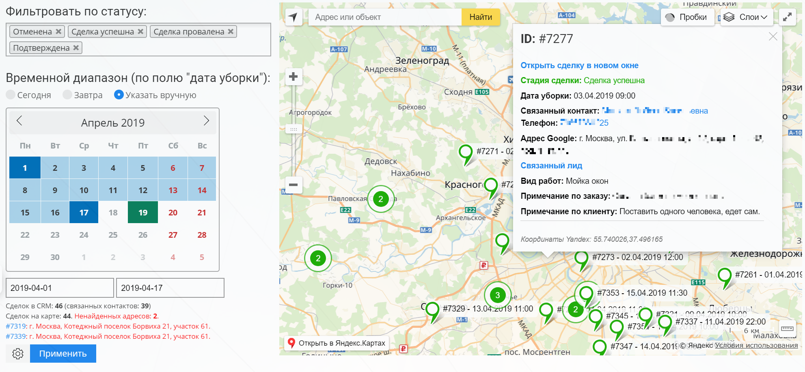
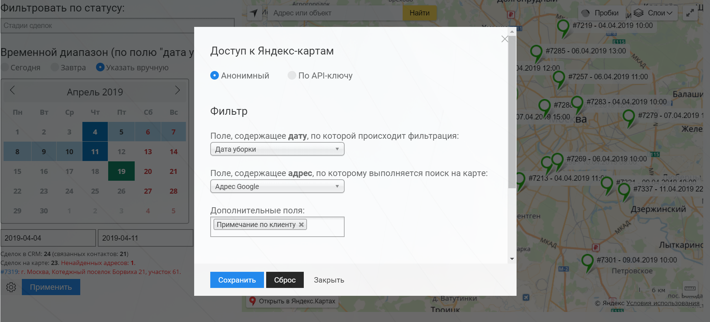
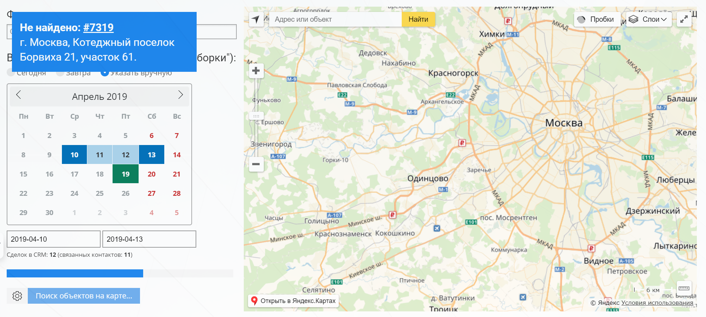

# Сделки Bitrix24 на карте 

Модуль для Битрикс24, показывающий сделки из CRM на Яндекс-картах.

Ищет адреса сделок с использованием геокодера Яндекса. Есть возможность фильтровать сделки по статусам и дате.

#### Общий вид

В настройках модуля можно указать:
1. api-ключ для доступа к картам;
2. поля сделки, содержащие дату и адрес для поиска;
3. дополнительные поля, которые будут выводиться в подсказках к точкам на карте.

Настройки сохраняются в базе текущей CRM (хранилище bitrix24).

В браузере сохраняются последние выбранные стадии сделок из фильтра.

Также при поиске модуль выводит ошибки о ненайденных адресах.

